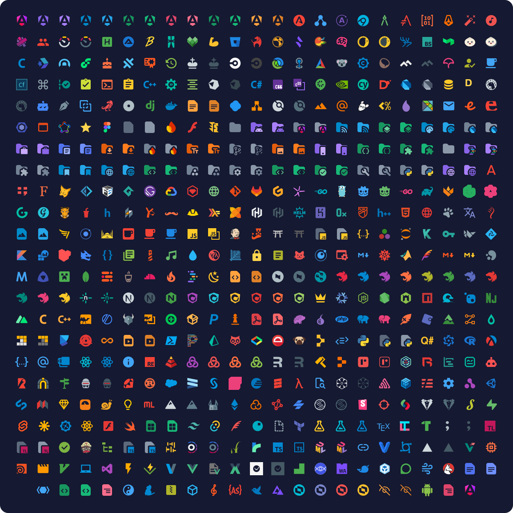

<h1 align="center">Monospace Icon Theme</h1>

Monospace icons for [Zed](https://zed.dev/).

---

These icons are derived from the Monospace Icon Theme for [Firebase Studio](https://firebase.google.com/studio) and are distributed under their original [LICENSE](LICENSE.md).

