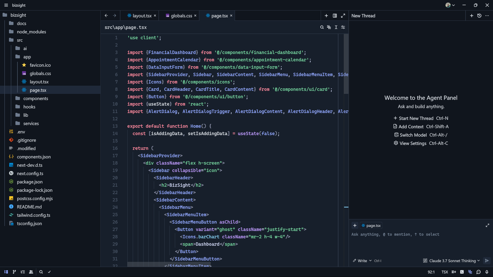
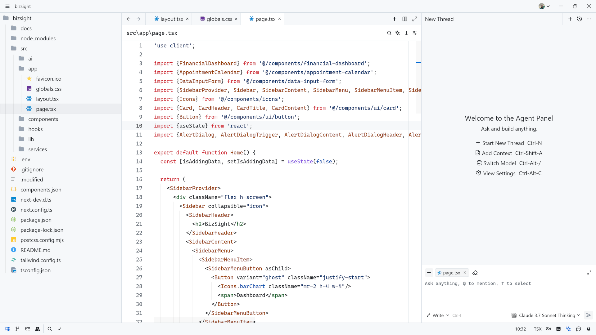

<h1 align="center">Monospace Icon Theme</h1>

Monospace icons for [Zed](https://zed.dev/).

Theme: [Monospace Dark](https://github.com/Abhinav5383/zed-monospace-theme)
  

Theme: Github Light

---

This icon theme is derived from [Firebase Studio](https://firebase.google.com/studio) Monospace icon set, which is licensed under Apache License 2.0 (http://www.apache.org/licenses/LICENSE-2.0). As required by this license, the original source is acknowledged, and this work is also licensed under [Apache License](LICENSE.md) 2.0.

